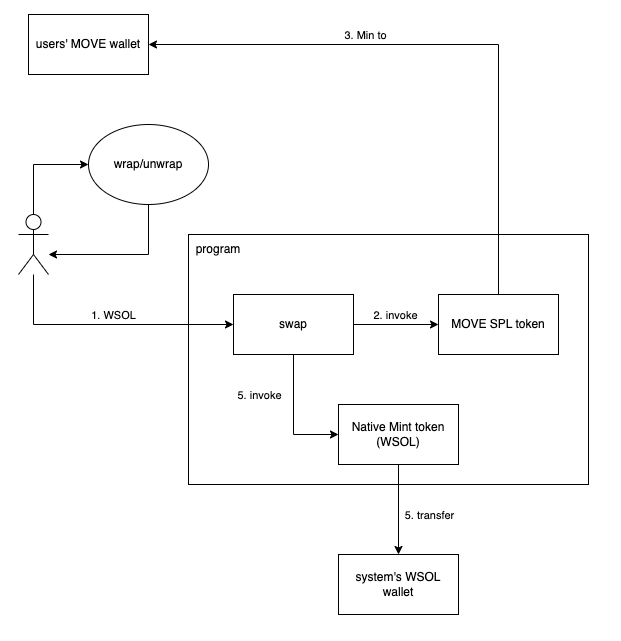

## MOVE swap



#### Requisites

1. Rust
2. [Solana cli](https://docs.solana.com/cli/install-solana-cli-tools)
3. Node v14

#### Get started

local development:

```bash
$ make local

# another terminal
$ make init
$ make deploy-local # output ProgramId
$ PROGRAM_ID="${PROGRAM_ID}" make swap-local

# test suite
$ make test
```

testnet:

```bash
$ make swap-local
```
